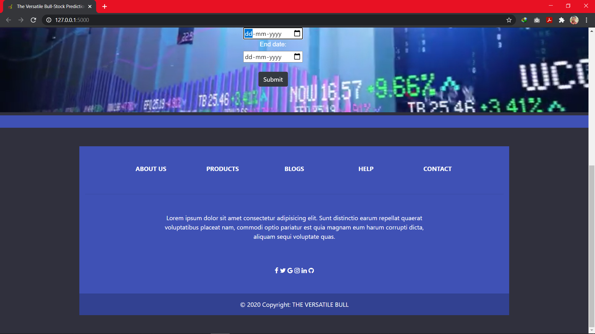
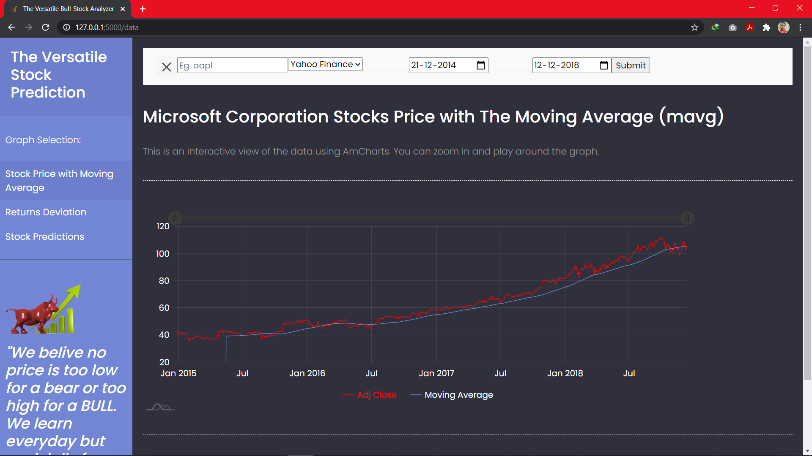
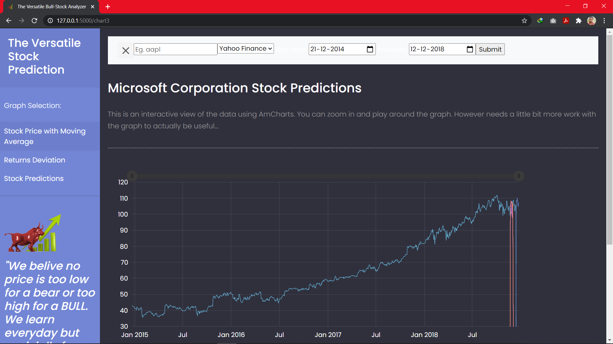

# THE VERSATILE-BULL - the stock prediction

This repository contains code for  stock prediction using the python program that predicts the price of stocks using a machine learning approach called Long Short-Term Memory (LSTM).Long short-term memory (LSTM) is an artificial recurrent neural network (RNN) architecture used in the field of deep learning. Unlike standard feed forward neural networks, LSTM has feedback connections. It can not only process single data points (such as images), but also entire sequences of data (such as speech or video).

## Technology used :
-Python
-Keras
-Tensorflow

## How it works :

## Step - 1

## Step - 2

## Step - 3

## Step - 4

## Step - 5

## Step - 6
